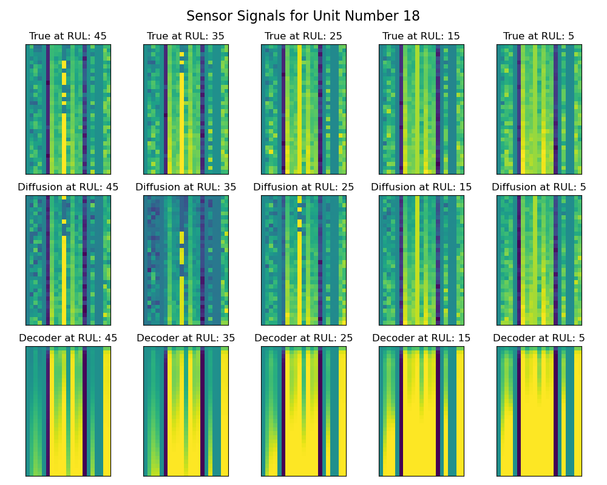
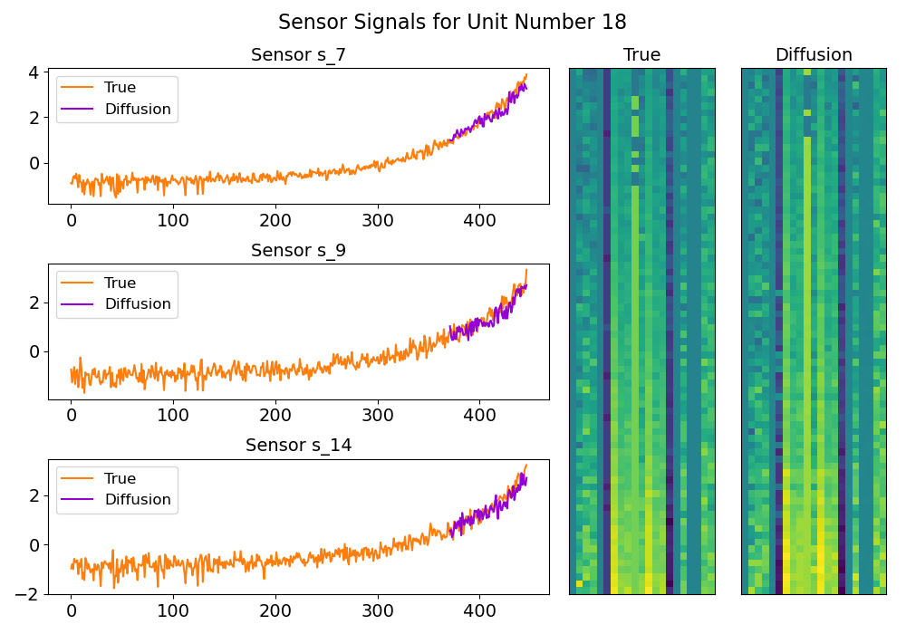

# MDS Thesis - Remaining Useful Life Estimation on Sensor Data

 

This repository contains the code and data for my Master's thesis on Remaining Useful Life (RUL) prediction. The thesis focuses on the application of machine learning and deep learning techniques to predict the remaining useful life of equipment and generate synthetic data.

The main contributions of this work are as follows:
- The introduction of the Time-Series Hybrid Autoencoder (TSHAE): This novel autoencoder-based model is capable of estimating differentiable degradation trajectories in the latent space. By leveraging a complex loss function based on trajectory-based metric learning, regression, and reconstruction losses, the TSHAE constructs a low-dimensional and interpretable latent space.
- An unsupervised method for extrapolating degradation trajectories: The
study proposes a technique to extend the initial test degradation trajectory.
By employing extrapolation techniques based on the most similar degra-
dation pattern and trajectory using latent spatial properties, the model gen-
erates complete degradation trajectories. 
- Utilizing extrapolated trajectories for generating input sensor signals: This is achieved through a generative diffusion model based on an adapted U-Net architecture. By conditioning the model on the latent trajectory representation, the generative model can generate realistic input sensor signals that align with the extrapolated degradation trajectories.





## Table of Contents

- [Environment Details](#Environment-Details)
- [CMAPSSData](#cmapssdata)
- [Notebooks](#notebooks)
- [Scripts](#scripts)
- [Configs](#configs)
- [Outputs](#outputs)
- [Requirements](#requirements)
- [Usage](#usage)
- [References](#references)


## Environment Details
The code in this repository was developed using the following environment:
```
python==3.9.16
numpy==1.24.3
pandas==1.5.3
matplotlib==3.7.1
torch==2.0.1
scikit-learn==1.2.0
scipy==1.9.3
```

## CMAPSSData

The `CMAPSSData` directory contains the necessary data for the RUL prediction task. It includes the training, testing, and RUL files for different equipment categories.

The CMAPSSData directory contains the dataset files required for the RUL prediction task. 
For more information about the dataset, refer to the [readme.txt](CMAPSSData/readme.txt) file in the CMAPSSData directory.


## Notebooks

The `Notebooks` directory contains Jupyter notebooks related to different stages of the project:


- [Diffusion.ipynb](Diffusion.ipynb): Notebook for diffusion analysis.
- [EDA.ipynb](EDA.ipynb): Notebook for exploratory data analysis.
- [RVE_MVP.ipynb](RVE_MVP.ipynb): Notebook for RVE (Remaining Useful Life) MVP.
- [metric.ipynb](metric.ipynb): Notebook for metrics analysis.


## Scripts

The `Scripts` directory contains Python scripts for various purposes:


- [ddpm_models.py](./models/ddpm_models.py): Python script for conditional diffusion.
- [tshae_models.py](./models/tshae_models.py): Python script for Time Series Hybrid Autoencoder (TSHAE).
- [tshae_train.py](tshae_train.py): Python script for Time Series Hybrid Autoencoder.
- [diffusion_plotter.py](diffusion_plotter.py): Python script for diffusion plotting.
- [diffusion_tester.py](diffusion_tester.py): Python script for diffusion testing.
- [finetuner.py](finetuner.py): Python script for fine-tuning.
- [loss.py](loss.py): Python script for loss functions.
- [main.py](main.py): Python script for main execution.
- [metric.py](metric.py): Python script for metrics calculations.
- [metric_dataloader.py](metric_dataloader.py): Python script for metric dataloader.
- [models.py](models.py): Python script for model definitions.
- [multirun_results_getter.py](multirun_results_getter.py): Python script for getting multi-run results.
- [noise_tester.py](noise_tester.py): Python script for noise testing.
- [test.py](test.py): Python script for testing.
- [train.py](train.py): Python script for training

## Configs

The `Configs` directory contains YAML configuration files for different components of the project, such as data preprocessing, diffusion, model selection, loss functions, optimizers, schedulers, and more.

The project utilizes the Hydra library for handling and managing these configurations.

- `config.yaml`: General project configuration file.
- `data_preprocessor`: Configuration files for data preprocessing related settings.
- `diffusion`: Configuration files for diffusion-related settings.
- `model`: Configuration files for model selection and architecture settings.
- `loss`: Configuration files for different loss functions.
- `optimizer`: Configuration files for optimizer settings.
- `scheduler`: Configuration files for learning rate scheduler settings.
- `random_seed`: Configuration file for setting random seed.

## Outputs

The `Outputs` directory is used to store the output files generated during the project, such as trained model weights, evaluation results, and plots.

## Requirements

The `requirements.txt` file contains the necessary Python packages and dependencies to run the code in this repository.

## Usage

To use this code, follow these steps:

1. Install the required dependencies by running: `pip install -r requirements.txt`.
2. Update the necessary configurations in the `Configs` directory to match your specific needs.
3. Run the desired scripts or notebooks for data preprocessing, model training, testing, and evaluation.

Please refer to the specific scripts or notebooks for detailed instructions and usage examples.

```console
foo@bar:~/MDS-Thesis-RULPrediction$ python tshae_test.py --checkpoint_path ./best_models/FD003/tshae/
```


## References

If you use this code or find it helpful, please consider citing the following references:

[in process]

